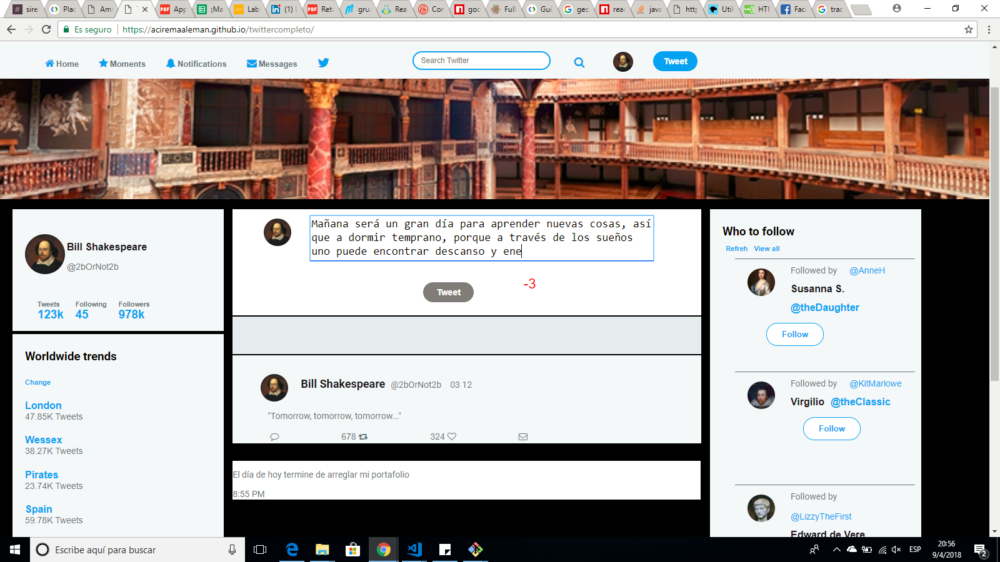

# Twitter

El proyecto de twitter se utilizó javascript, html, css para el diseño de la página de Twitter y para la funcionalidad del textarea.

Cabe destacar que el proyecto se realizo en equipo, fue el primer trabajo en equipo que realice en laboratoria.

proyecto hecho para labaoratoria.